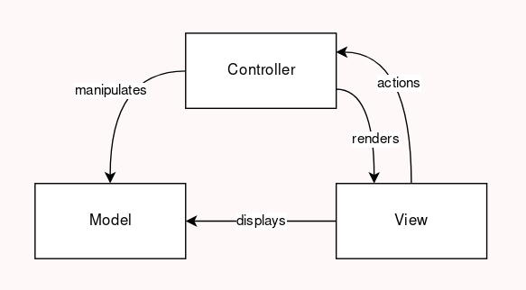
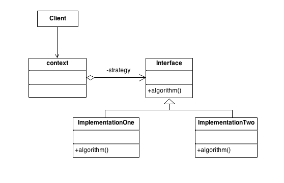
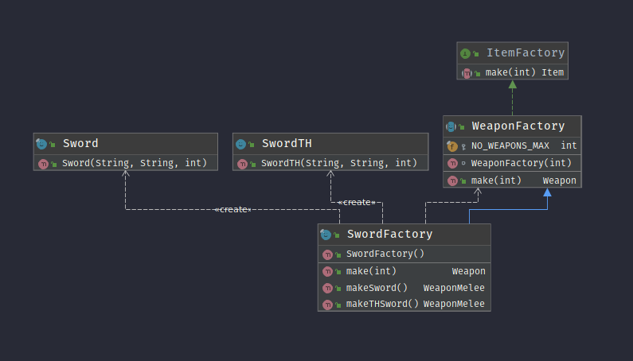
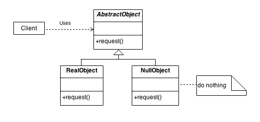
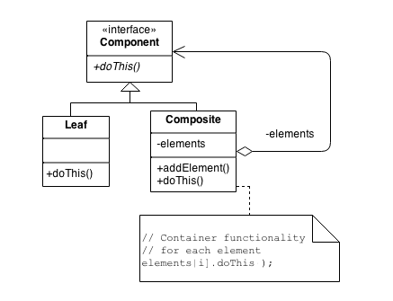

# Calamity: Black Nights Onward

**Calamity: Black Nights Onward** is a post-apocalyptic survival game based on the game **Cataclysm: Dark Days Ahead**. It has a turn based flow: that means the game moves only when the player takes an action (walking or interacting with the environment for example) and a very detailed character creation (with different backgrounds granting different stats).
The game works on a **split screen design**: the left section of the screen displays the environment the user is playing (it shows the monsters, the terrain, the player character itself etc...), the right screen displays relevant information to the player like character status and conditions (hungry or unconformable for example) and a log of the events the character is experiencing.
The game also has an extra mode: the view mode. In this mode the player is able to move the screen freely without moving its character. The right section of the screen now shows information about the object the player is selecting.
The objective of the game is simply to survive the longest time you can!

## Implemented Features

The "playable" part of the game consists simply in a character that walks in a randomly generated world and can interact with doors as well as spawn some items. The player's hunger and thirst stats drop with the pass of time. When the hunger reaches zero the player starts loosing health, when the thirst depletes the player dies instantly.
 - Status bars that show player status in real time in a graphical way, using colors.
 - Attribute display, updating player attribute values in real time.
 - Randomly generated map, right now the map is quite small, but it is easily expansible.
 - Randomly generated items, both two handed and one handed, that can also be unequipped.
 - Wall and Enemy collision detection, the player is not allowed to move when adjacent to a wall or enemy.
 - Door interaction, a door opens or closes when the player presses **F4** adjacent to it. 
 - Change view mode between Lanterna and Swing. The swing view is not fully functional at the moment as the code responsible for key event detection is not working.

## Planned Features
 Right now the game starts in the map with a default player. In the future, we wish to implement a state machine that will iterate through various game states: Main menu, Character Creation, Playing the Game, Save Screen, Death Screen, Exit.
- Enemies and the combat system are not fully implemented. Internally in the code there's a "baby" combat system but we haven't implemented for the player to attack or even for the enemies to hunt the player and trying to kill him.
- Consumables for the player to replenish the Hp, hunger and thirst. Like we said before, most of the foundation code is already in place, we just need to specify and apply it in the Game itself.
- The inventory system is somewhat in place, we can spawn a one handed sword by pressing **F1** and equip it, same goes for two handed (**F2**), and unequip (**F3**). This mostly requires a inventory menu to transfer items from any sort of **ItemContainer**.
- Intractable objects in the world besides **Doors**.

## Design

### The main architecture

#### Problem in Context

The first design we needed to think of was the main architecture of the program. We needed a way to organize the code in packages such that it would follow a consistent structure that would enable us to develop the project easily without creating a mess in code we developed previously.

#### The Pattern

We chose to use an MVC architecture (Models,Views and Controllers). We found this was the architecture that suited our needs the best. We would have a package representing the Model, basically the game logic. A package for the controller: that would control the other two packages. The view package would be responsible for displaying everything using lanterna. This architecture is a good implementation of the single responsibility principle.

#### Implementation

We implemented the Model package in the GameCore package. This package controls all that has to do with characters, items and game logic. The UserInterface is the View package. It is responsible for displaying the graphical representation of several aspects of the game when the Controller asks for it. The Game package is the controller. It has the main function that is called to start the game, the game loop and functions that control all the flow of the game.

#### Consequences

The architecture did its job, although we are still in an early stage of the project, we were able to organize our code in such a way it remained pretty much smell free (see the next section) while respecting all the SOLID principles. It was also a good idea now that we have to make our game run both using lanterna and swing terminals.

### Making the view modular

#### Problem in Context

It the beginning we wanted to make each part of the MVC architecture as independent of the others as possible. At the time we did not know we would need our game to change between the Lanterna and the Swing view. In order to solve that problem, we chose to use a Strategy Pattern.

#### The Pattern

The Strategy Pattern consists in programming a generic interface that a client should use and not an implementation. Different concrete implementations of that interface are then programmed. This grants the open-closed principle (open for extension, closed for modification).

#### Implementation
Our Abstraction is the **Screen** interface that establishes what a screen should do. Then we have our two "strategies" that implement that interface : **LanternaMainScreen** and **SwingMainScreen** that will be used by the **Game** class, our client. 

#### Consequences
This design pattern allows the **Game** class to not have any responsibility in how the several elements of the game are displayed on the screen. We only have to pass a **Screen** (either the Lanterna or the Swing one) in the class constructor for it to be able to do what it's supposed to. This also allows us to add as many screens as we want without needing any refactoring. We just need to implement the interface and pass it as parameter in the **Game** constructor.

### Factory Method, Abstract Factory and Simple Factory

Looking at the UML diagram, we can see that the abstract class **Item** has a lot of subclasses. Items throughout the world have to be randomized from a given set. The problem here is that we need an interface that can let a factory decide which Item to instantiate. In terms of **abstract factories**, we only did for the **Weapon** class but the rest of the abstract factories for the all the types of **Items** can be easily developed.

#### Implementation

The class **ItemFactory** is a simple interface that holds one method: **Item make(int i)**. Any other **abstract factory** has to implement this, the **i** value represents which type of item to make, this varying at each **Simple Factory** discretion. In our code, **WeaponFactory** represents an abstract class that all factory that make Weapons must follow. An example of this is the **SwordFactory**. It's a **Simple Factory** that creates two types of swords: one handed or two handed. 

#### Consequences

When introducing new types of **Item** it's easy since you only need to create a new **Abstract Factory** and a **Simple Factory** and "tell" your code to use it. This increases extendability following the **Open/Close Principle**, the only thing I need to change in the original code is the instantiation of the new class and it should work without the need to change the old code.

### Dealing with null objects

#### Problem in Context

In the case of the weapons and items we need to initialize the player inventory with null values of those objects. In short we wanted to create objects that represent the absence of an object. 

#### The Pattern

The Null Object patterns consists in creating an abstract class that defines an interface for the object itself. Then we have both a concrete object and a null object implement that interface. The difference being that the concrete object implements the methods defined in the interface in the way that they are supposed to, and the null object implements them in a way that they to nothing or return a value that indicates we are dealing with a null object.

#### Implementation
We used this pattern for both weapons and items. We defined an abstract class for each of them (**Weapon** and **Item** classes). Then we created the several weapons and items we needed, extending those abstract classes. For the **NullWeapon** and **NullItem** classes we simply overrode the isNull method, returning true.

#### Consequences
This Design Pattern allowed us to initiate the player equipped items as null, that be, the player has no item in that slot, without having check for null references.

### Aggregating all the drawers

#### Problem in Context
We created a drawer for each entity in the game, we did that to abstract completely the way an entity is drawn from the entity itself, respecting the **Single Responsibility Principle**. We also wanted to call all the drawers using a single command, as well as interacting with all the common aspects of all the drawn classes without having to iterate through all the drawers each time we wanted to do so. So, we decided to abstract those iterations!

#### The Pattern

The Composite pattern consists of having an aggregation of components, being the aggregation a component itself. We have an Component interface that defines what a component should do. Then we have concrete components that implement that interface and a component aggregation, that also implements that interface. Because the aggregation has the same methods as a simple component, we can use the aggregation as a component and apply a method to all objects in the aggregation with a single call of a method. This also allows us to have an aggregation of aggregations defining a tree structure.

#### Implementation
We created an abstract class defining what a drawer should do as well as some methods that would be shared by all specific drawer classes, the **EntityDrawer** class. Then we created the concrete drawers extending from that class. Then we created the **DrawerComposite** class, also extending from **EntityDrawer**, that stores an ArrayList of EntityDrawers. We defined the draw method in that class iterating through all the drawers and calling the draw method in each one.

#### Consequences
The implementation described above allowed us to achieve what we wanted initially. It does not, however, use the full potential of a Composite design pattern: the tree structure, but it allows us tu use that in the future very easily if we want to, respecting the **Open-Closed Principle**. It also respects the **Single Responsibility Principle**, making it easy to add new drawers for new entities if we want to.

## Known Code Smells and Refactoring Suggestions
Since the game is in its early stage, we focused on carefully programing and tried to keep things as simple as possible hence the code won't have few or any smells at all given its simplicity and primitive state. Most likely there will be smells in the controller part of the program that receives *key strokes* from the terminal, specifically ***switch statements*** if we are not careful enough. Earlier we had the responsibility to draw any entity given to the GameLogic package, but after a while we realized this package should only concern itself with making the background calculations while a new package should be created to ask information on how to draw either entities or walls.

The **EStat** class may be a case of a **Large Class** since it has a lot of parameters and a lengthy function *updateDependants()* that updates the dependant stats of the 4 primary stats **(Strength, Dexterity, Perception Intelligence)**  and will likely have others.

## Testing Results
Testing results can be seen opening the **docs/testcoverage/index.html** file in a browser

## Self-evaluation
The work was split evenly between the two. One of our problems is that we were too ambitious in terms of features and ended up only doing a foundation for the game than the game itself. What we have done is easily expandable into a full fledged game, assuming we don't find any other bugs down the road. 
